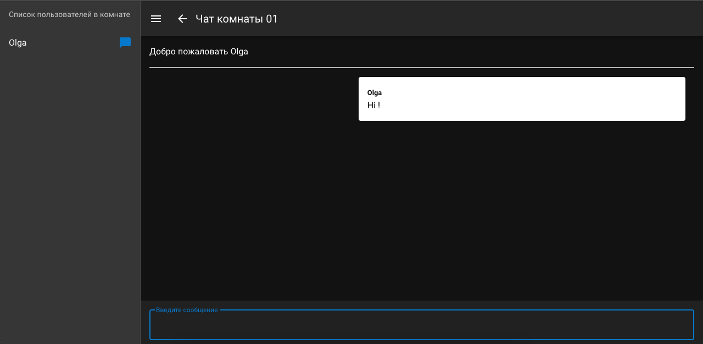

### О проекте.  
Web-интерфейс с клиент-серверной архитектурой. 
  
**Описание функционала**   
Взаимодействие пользователя с интерфейсом начинается с его авторизации.  
Пользователь вводит своё имя и номер комнаты, затем переходит на страницу, где может обмениваться сообщениями с авторизованными пользователями чата.  
Левая панель интерфейса отображает список пользователей.  
Отправка сообщений происходит нажатием на клавишу Enter.  

**Инструменты**  
Vue, Nuxt, Express, Vue-Socket, Vuetify. 
 
**Команды запуска**  
```bash
# install dependencies
$ npm install

# serve with hot reload at localhost:3000
$ npm run dev

# build for production and launch server
$ npm run build
$ npm run start

# generate static project
$ npm run generate
```