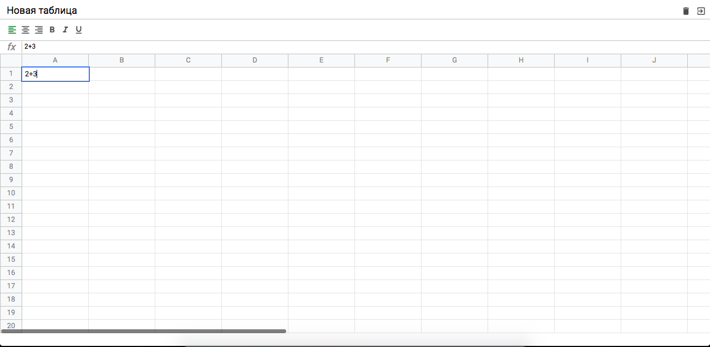

### О проекте.  
Web-интерфейс для расчета математических выражений, аналог MS Excel / Google Docs.  

   

**Описание функционала**   
- создание новой электронной таблицы;
- ввод данных в ячейки таблицы и ячейку формулы;
- масштабирование ячеек;
- выделение нескольких ячеек, удерживая клавишу SHIFT;
- форматирование текста в ячейках;
- форматирование названия заголовка электронной таблицы;
- удаление электронной таблицы;
- сохранение электронной таблицы с внесенными данными. 
  
**Инструменты**   
Javascript, Scss, Webpack, Babel.  

**Команды запуска**    
Установка зависимостей: 
```javascript
npm install
```  
Запуск проекта в dev-режиме:  
```javascript
npm run start
```  
Запуск проекта в prod-режиме:  
```javascript
npm run build
```        