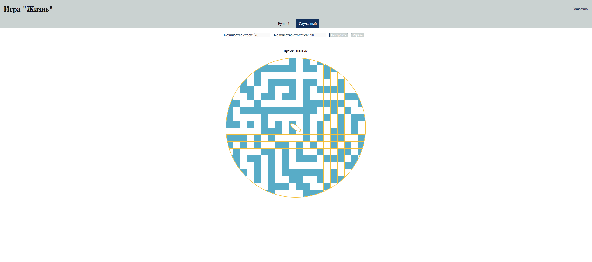

### О проекте.  
Игра "Жизнь".  
Игра создана на основе клеточного автомата Джона Конвея.    

  

**Описание функционала**  
Игрок выбирает режим игры: ручной или случайный.  
В ручном режиме игрок самостоятельно с помощью мыши инициирует начальное состояние клеток.  
В случайном режиме начальное состояние клеток инициируется автоматически.  
После выбора режима необходимо задать размер игрового поля (колчество строк и количество столбцов).  
После того, как размер поля задан, необходимо нажать на кнопку "Построить" для генерации поля.  
После генерации поля необходимо нажать на кнопку "Играть".  

**Инструменты**    
Javascript, CSS, HTML.