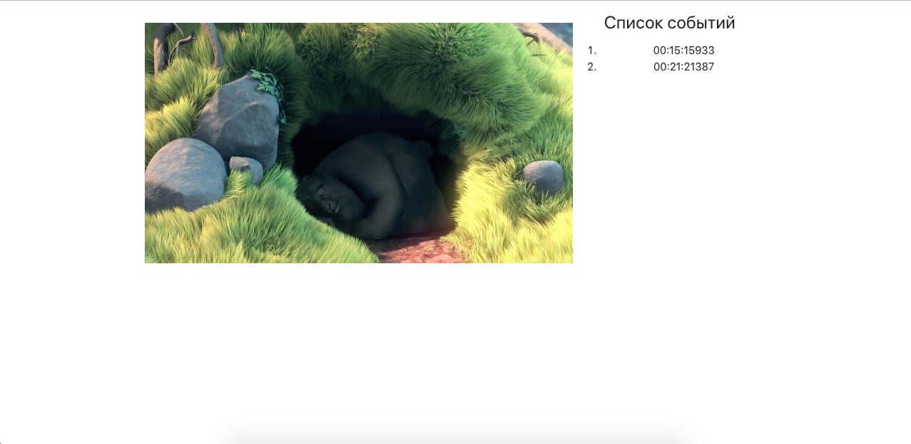

### О проекте.  
Интерфейс видеоплейера.  
  

**Описание функционала**  
После запуска плейера начинает проигрываться мультипликационный фильм.  
В момент паузы фильма в правую панель интерфейса (Список событий) записывается время остановки просмотра.  
В некоторый момент времени поверх видео рисуется прямоугольник.    
После нажатия на запись из списка событий, видео начинает проигрываться с момента начала этого времени.     
Остановка и воспроизведение видео происходит с помощью кнопок на панели управления плейера, а так же  с помощью клика на область видео.  

**Инструменты**  
React, Redux, Redux Saga, Typescript, Jest, HTML5 api video.  
  
**Команды запуска**  
Установка зависимостей: 
```javascript
npm install
```   
Запуск проекта:  
```javascript
npm run start
```  
Запуск теста:  
```javascript
npm run test
```

