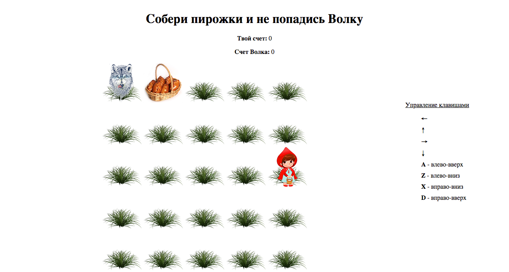

### О проекте.  
Игра "Красная Шапочка и Серый Волк".  

  

**Описание функционала**  
Игрок управляет Красной Шапочкой.   
Цель игры: собрать пирожки и не попасться Серому Волку.  
Управление персонажем происходит с помощью клавиш клавиатуры.  
Если Красная шапочка попалась Серому Волку, он забирает все набранные очки (пирожки) Красной Шапочки.  

**Инструменты**    
Javascript, CSS, HTML.