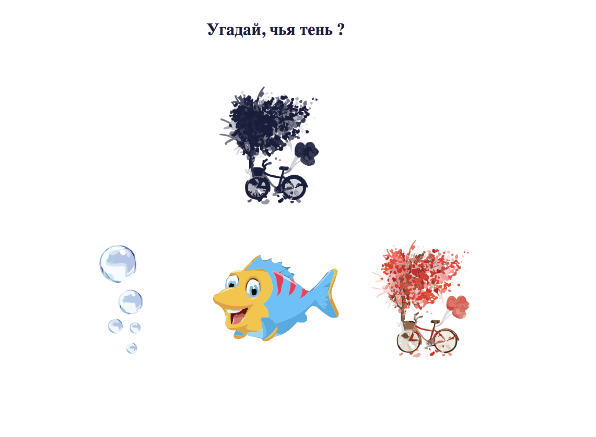

### О проекте.  
Игра для детей на внимание. 

  

**Описание функционала**  
На главной странице интерфейса располагается заголовок, изображение и кнопка перехода к игре.  
После нажатия на кнопку перехода к игре открывается игра "Угадай, чья тень?".  
В случае удачи, открывается страница победы.  
В случае проигрыша, открывается страница проигрыша.  

**Инструменты**   
Next.js, React, Mobx, Typescript, API Created, Ant Design, Scss.  

 **Команды запуска**  
```bash
# install dependencies
$ npm install

# serve with hot reload at localhost:3000
$ npm run dev

# build for production and launch server
$ npm run build
$ npm run start
```