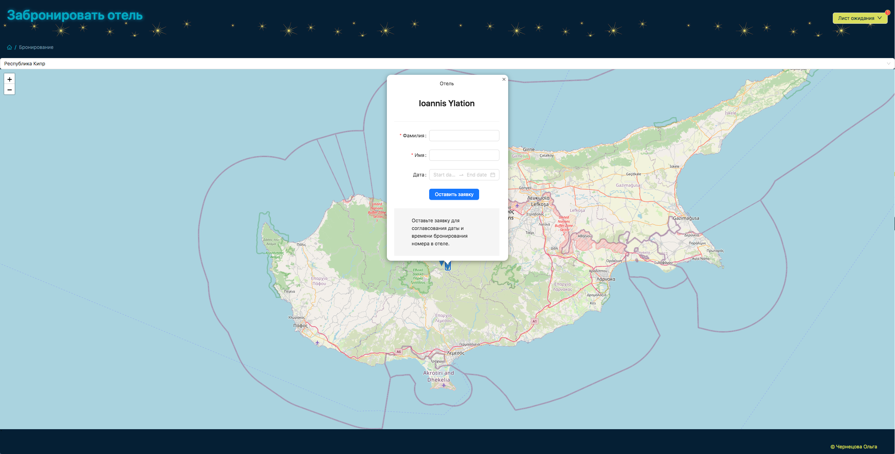

### О проекте.  
Web-интерфейс с клиент-серверной архитектурой.  

 

**Описание функционала**  
 На главной странице интерфейса предоставлена общая информация о некоторых отелях.  
 После нажатия на кнопку "Перейти к бронированию", пользователь переходит на страницу бронирования отеля.  
 На странице Бронирования отображается карта. После выбора страны в поле автопоиска, карта прокручивается к местоположению страны с отметками местонахождения отелей.  
 После нажатия на отметку, открывается форма бронирования для ввода необходимых данных.  
 После успешной отправки данных на сервер, список забронированных отелей отображается в контейнере "Лист ожидания".  
 Интерфейс развернут на платформе Vercel ([смотреть](https://booking-seven-kappa.vercel.app/)).  

 **Инструменты**  
 Next.js, React, Redux Toolkit, Typescript, API Created, Leaflet, Ant Design, IndexedDB, Scss.  
 Rest API: [REST Countries](https://restcountries.com/), [Travelpayouts](https://support.travelpayouts.com/hc/en-us/articles/115000343268-Hotels-data-API).  

 **Команды запуска**  
```bash
# install dependencies
$ npm install

# serve with hot reload at localhost:3000
$ npm run dev

# build for production and launch server
$ npm run build
$ npm run start
```